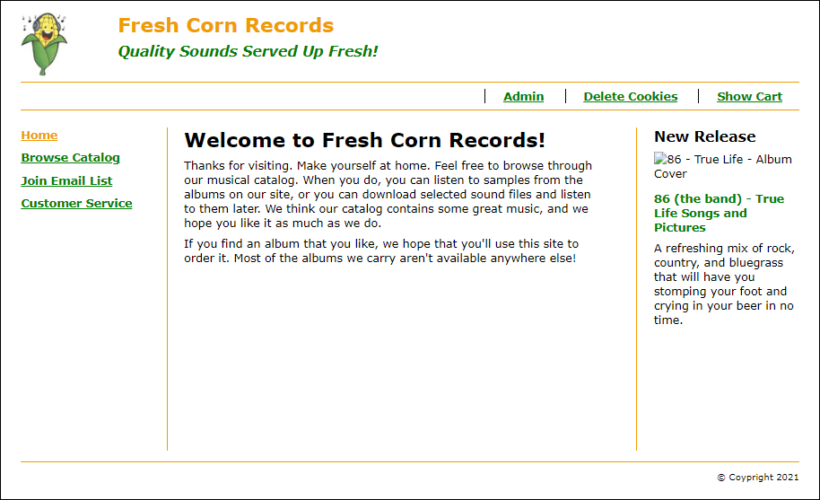

# User's Guide

This app is written without using IDE, so all the work of writing, compiling must be done manually.  
1. Compile all file in [src](src) into a directory named classes, with the same order (ex: src/music/business/ ... into classes/music/business/ ...). Suggest using -d option:  
```sh
    cd **/src/
    javac -d ./classes ./music/business/Product.java
```
This app uses some additional libraries: [servlet-api-3.1.jar](https://mvnrepository.com/artifact/javax.servlet/javax.servlet-api/3.1.0), [apache.poi-3.7](https://mvnrepository.com/artifact/org.apache.poi/poi/3.7). For example:
```sh
    javac -d ./classes -cp ".;**/servlet-api-3.1/jar" ./music/util/CookieUtil.java
```
2. Copy files into tomcat's webapps directory, the directory structure like below:  

```
tomcat
└── webapps
    └── musicStore
        ├── admin
        ├── cart
        ├── catalog
        ├── customer_service
        ├── email
        ├── images
        ├── incluses        
        ├── META-INF (content.xml file)
        ├── sound
        |   ├── 8601
        |   ├── jr01
        |   ├── pf01
        |   └── pf02
        ├── styles
        ├── catalog.jsp
        ├── index.jsp
        ├── login.jsp
        └── WEB-INF (web.xml file)
            ├── classes (the root directory for java classes)
            |   └── music
            |       ├── business
            |       ├── controller
            |       ├── data
            |       └── util
            └── lib (JAR files for Java class libraries)        

```
3. Run Tomcat (this app use Tomcat 8.5)
4. Access at [http://localhost:8081/musicStore](http://localhost:8081/musicStore)  
Homepage

5. You can try listening short records, or register to buy CD(s)